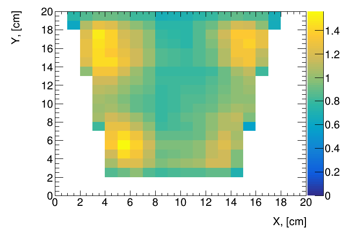
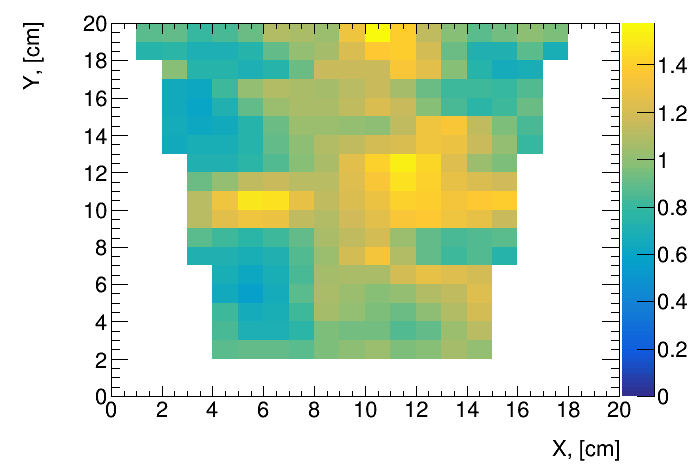
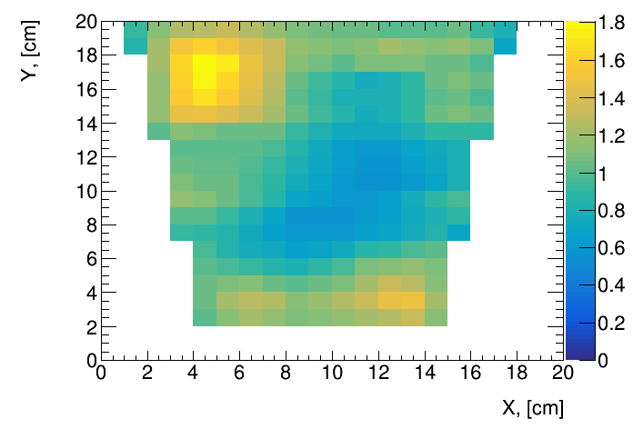
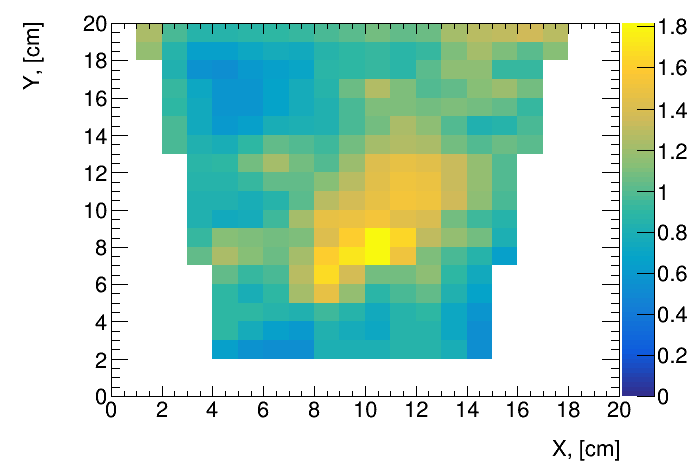
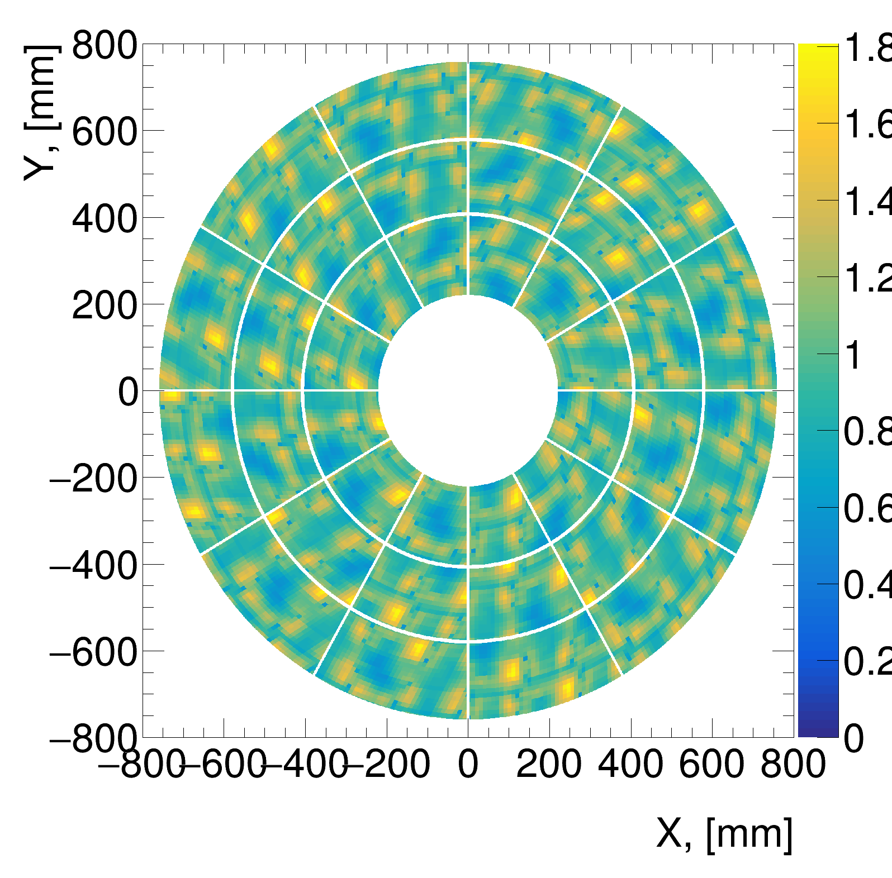
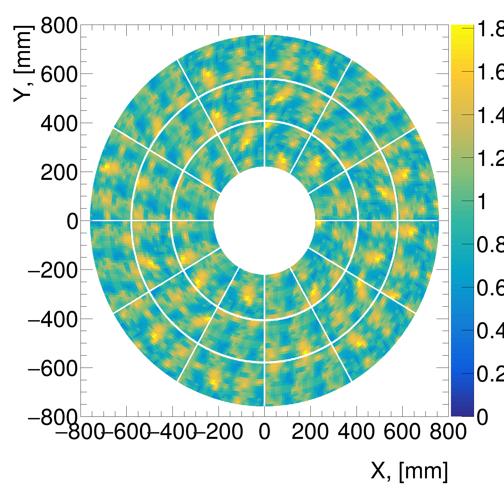

# TPC Gain & IB maps generation macro.
This macro is generating maps of Gain and IBF for the sPHENIX TPC.

## Input.
As an input the macro uses calibration measurements from Yele University for two modules IROC 35 & 38:
- IROC 35

<p float="left">
  
   
</p>

- IROC 38

<p float="left">
  
   
</p>

## Output.
The macro writes the file *./Files/IBF_Map.root* with the "fake" maps for sPHENIX TPC readout:
<p float="left">
  
   
</p>

## Running macro.

- Setup local environment: ```source /opt/sphenix/core/bin/sphenix_setup.sh -n```
- Run in the batch mode: ```./makeMap.py -b```